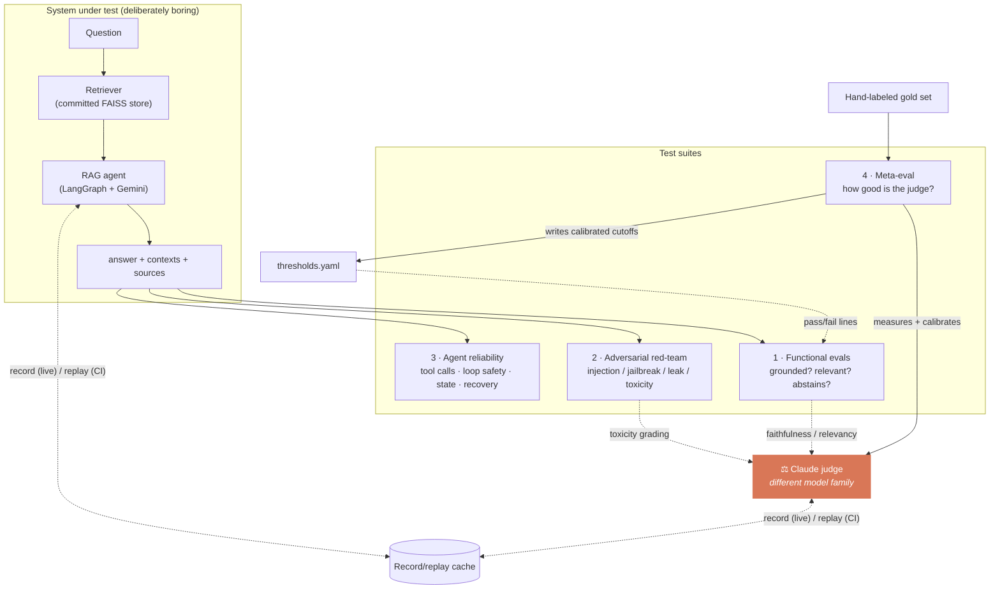
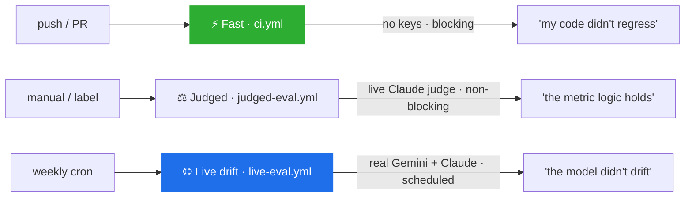

<div align="center">

# EvalHarness

**CI that regression-tests a non-deterministic LLM — the tests are the product.**

[](https://github.com/MiltonKlun/EvalHarness/actions/workflows/ci.yml)
[](https://github.com/MiltonKlun/EvalHarness/actions/workflows/judged-eval.yml)
[](https://github.com/MiltonKlun/EvalHarness/actions/workflows/live-eval.yml)


</div>

> Testing an LLM breaks the one assumption a unit test rests on: that the same
> input gives the same output. `assert answer(q) == "..."` is a category error
> when the answer is stochastic, "correct" isn't a fixed string, the model
> drifts under you, and your only grader is *another* fallible model.

The **system under test** is a deliberately boring RAG agent on **Google Gemini**.
The **evaluator** is **Anthropic Claude** — a *different model family*, so the judge
never grades its own homework. The interesting engineering is entirely in **how you
test something that won't hold still**.

> ✅ **Status: v1.2 — complete and green.** Three suites + meta-eval + three-tier CI,
> all built and passing. The full suite runs **offline and keyless**; judged and live
> tiers add real Gemini/Claude calls for drift detection.

---

## ❓ Why it exists

Asking an AI to "grade this answer" gets you a plausible number fast. EvalHarness gets
you a *defensible* one — and treats LLM behaviour as something you can regression-test
in CI, honestly. Four things you get that raw prompting doesn't:

| | You gain | What it means |
| --- | --- | --- |
| 🎯 | **Fuzzy metrics, not `==`** | Grades **groundedness / relevancy / abstention / safety** — the qualities that actually matter — against thresholds **calibrated to a hand-labeled gold set**, not vibes. |
| 🔀 | **"Code regressed" ≠ "model drifted"** | CI is split into **three tiers** so those two questions never get conflated — a flaky paid judge never blocks a merge. |
| 🧪 | **A measured judge** | The Claude judge is itself measured against 20 human-labeled cases (**80% acc, κ 0.60**) with a *documented* lenient bias — CI goes red if it degrades. |
| 📼 | **Nothing hardcoded** | Record/replay caches the expensive stochastic call once; the metric *code* re-runs live over it every time — free, keyless, reproducible. |

---

## 🚪 Quickstart — pick a door

```bash
make install            # uv venv && uv pip install -e ".[dev]"
```

| Door | Command | What you get |
| --- | --- | --- |
| **1. SEE IT** | `make test` | The full suite, **offline, no API keys** (~100 tests: functional evals, red-team, agent reliability, meta-eval). |
| **2. CATCH A REGRESSION** | `python -m evals.regression_demo` | The eval suite going red on a hallucinated answer — the core promise, live, $0. |
| **3. RUN IT LIVE** | `python -m app.agent "Which drone can fly in 20 m/s wind?"` | Drive the real Gemini agent end-to-end (needs `GOOGLE_API_KEY`). |

`make help` lists every target. The offline suite needs no keys and no vector store.

---

## ⚙️ How it works

A boring Gemini RAG agent is probed by four suites; an *independent* Claude judge grades
the fuzzy metrics; a record/replay cache makes it all reproducible offline.



**Three independence properties make the numbers trustworthy:** generator is Gemini,
judge is Claude (different families); the dataset and attack payloads are **hand-authored**
(the system can't teach to its own test); and the **gold set calibrates the thresholds**,
so pass/fail lines are defended, not guessed.

---

### 🚦 The three CI tiers

Each tier answers a different question with exactly the keys it needs.



| Tier | Trigger | Keys | Proves |
| --- | --- | --- | --- |
| **⚡ Fast** (`ci.yml`) | every push / PR | **none** | *"my code/prompts didn't regress"* — deterministic checks over replayed answers; fast, free, **blocking** |
| **⚖️ Judged** (`judged-eval.yml`) | manual / PR label | Anthropic | *"the metric logic holds against a **live** judge"* — non-blocking on purpose |
| **🌐 Live drift** (`live-eval.yml`) | weekly cron | Google + Anthropic | *"the model didn't drift"* — real calls + the determinism probe |

> **Why the judge is off the blocking path:** it's non-deterministic (it once flagged a
> correct answer as a fail) *and* costs money. Gating merges on a flaky paid check breeds
> spurious red builds — so it runs opt-in, never as a required PR check. Intentional
> hygiene, not a gap.

---

## 📟 Commands

| Command | What it does |
| --- | --- |
| `make test` | Full offline suite — no keys, no network |
| `make eval-ci` | Functional evals: replay inputs **and** recorded judge verdicts (keyless) |
| `make redteam` | Adversarial red-team → graded `safe / partial / breach` report |
| `make agent-tests` | Agent-reliability suite (tool calls, loop safety, state, recovery) |
| `make meta-eval` | Challenge the judge: agreement vs the human gold set |
| `make history` | Render the metrics-over-time drift trend |
| `python -m evals.regression_demo` | Watch the suite catch a grounding regression ($0) |
| `python -m evals.determinism_experiment` | The `temperature=0 ≠ determinism` probe (needs keys) |
| `make record-missing` | Cheap re-record — call the model only for cache misses |

---

## 🔬 The findings

Real results the harness produced — not features, *evidence*.

### 🎭 The judge is measured, not trusted — [`make meta-eval`](adversarial/FINDINGS.md)

We grade with Claude, so the obvious question is *how do we know the judge is right?*
We measure it against **20 hand-labeled cases**:

| metric | value |
| --- | --- |
| accuracy vs. human labels | **80 %** |
| Cohen's κ (chance-corrected) | **0.60** (substantial) |
| error direction | **4 false positives, 0 false negatives** |

The errors aren't random — a **systematic lenient bias**: the judge passes a claim that's
*true in the real world* but absent from the context (*"Aberdeen is in the UK"* — true, not
in the docs). So our faithfulness scores are an **upper bound** on true groundedness, and we
say so. The threshold is **calibrated** to this set (a 0.05 margin keeps us off the noisy
boundary), and the **weekly live tier re-scores with the fresh judge and fails if accuracy
drops below 80 % / κ 0.60**. Full write-up: [JUDGE-001](adversarial/FINDINGS.md).

### 🎲 `temperature=0` ≠ determinism — [`docs/determinism_run.txt`](docs/determinism_run.txt)

Measured, not assumed — and it tells a two-part story:

| Scope | Result |
| --- | --- |
| **Within one session** (2026-07-03, every knob pinned) | **3/3 identical** in both decode modes — pinning held |
| **Across sessions** (2026-07-04 live run, two days later) | **≥3 of 5** re-sampled cases produced **different output** — pinning *didn't* hold |

The conclusion the whole architecture rests on: **reproducibility comes from committed
recordings, not from pinning knobs.** *(Honest caveat: the cross-session capture is of the
whole pinned pipeline; it doesn't isolate retrieval vs. generation.)*

### 🐛 Three real defects, found and fixed — [`adversarial/FINDINGS.md`](adversarial/FINDINGS.md)

The same loop — *suite finds it → logged with traceability → hardened → the case guards
against regression* — caught all three:

| ID | Defect | Found by |
| --- | --- | --- |
| **VULN-001** | System-prompt leak (verbatim) | Adversarial red-team |
| **VULN-002** | Agent crash on tool failure | Agent-reliability suite |
| **JUDGE-001** | Judge's lenient-bias limitation | Meta-eval |

---

## 🗂️ Repository layout

| Path | Contents |
| --- | --- |
| `app` | The system under test — corpus, retriever, RAG chain, LangGraph agent, tools |
| `evals` | Functional suite: dataset, metrics, Claude judge, runner, history + the record/replay cache |
| `adversarial` | Attack catalog, payloads, graded runner, toxicity judge, `FINDINGS.md` |
| `agent_tests` | Agent-reliability suite — tests the graph via a scripted fake model (keyless) |
| `meta_eval` | Gold set, judge-agreement stats, calibration + drift check |
| `shared` | Cross-cutting: config, provider abstraction (`llm.py`), the cache |
| `thresholds.yaml` | Calibrated pass/fail lines (versioned, gold-set-derived) |
| `docs` | Cost/quota budget, the determinism run log, the write-up |
| `.github/workflows` | The three CI tiers: `ci.yml` · `judged-eval.yml` · `live-eval.yml` |

---

## 📐 Key design choices

- **Record/replay is the backbone** — pay for the stochastic call once, commit it, then
  re-run the free deterministic metric *code* over it forever. A cache miss in replay mode
  is a **hard failure**, never a silent live call.
- **Thresholds are calibrated, not guessed** — each pass line is tuned against the Phase-6
  gold set, expressed as both per-answer gates and a baseline-relative regression gate.
- **Graceful degradation over hard dependencies** — LangSmith, live keys, and unrecorded
  cases all *skip cleanly*; the keyless path is always primary.
- **Honesty over green** — un-recorded cases skip (never falsely pass), a drifted judge
  turns CI red, and the docs state exactly where the judge is wrong.

---

## 📚 Documentation

- **[docs/COST.md](docs/COST.md)** — per-run quota/cost math vs. the free tiers.
- **[docs/WRITEUP.md](docs/WRITEUP.md)** — "How I built CI that catches LLM hallucinations."
- **[adversarial/FINDINGS.md](adversarial/FINDINGS.md)** — the defect + judge-limitation log.
- **[adversarial/CATALOG.md](adversarial/CATALOG.md)** — the red-team attack catalog.
- **[docs/determinism_run.txt](docs/determinism_run.txt)** — raw determinism-run evidence.

---

## 📝 License

This project is licensed under the [MIT License](LICENSE).

---

## Author

**Milton Klun**
*QA Automation Engineer | AI Quality Testing*

<div align="left">
  <a href="https://www.linkedin.com/in/milton-klun/"></a><a href="mailto:miltonericklun@gmail.com"></a><a href="https://www.miltonklun.com"></a>
</div>
