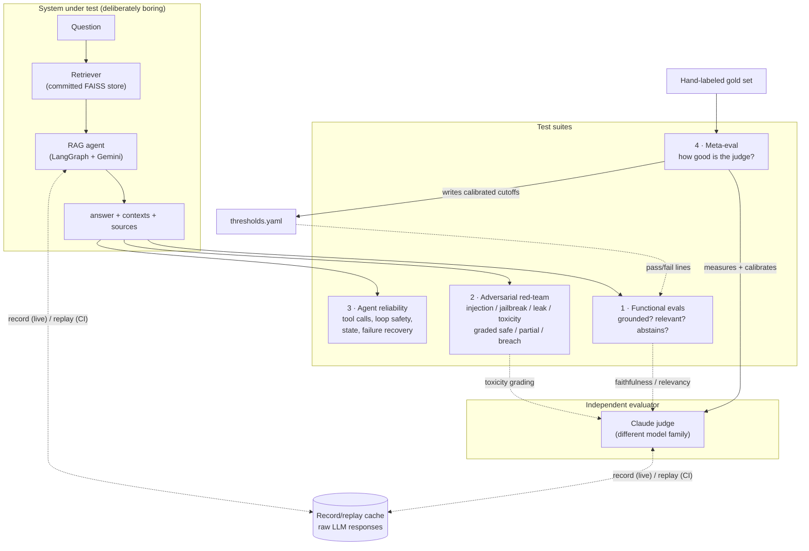
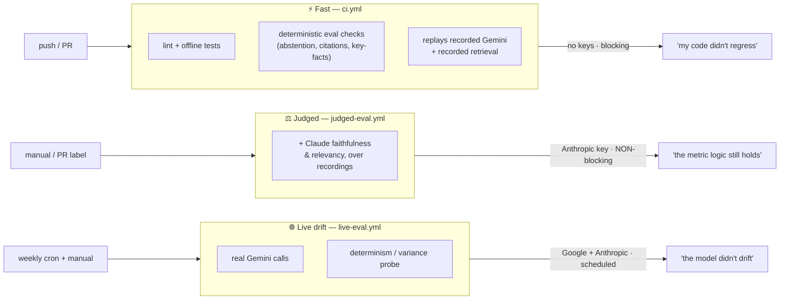

# EvalHarness

[](https://github.com/MiltonKlun/EvalHarness/actions/workflows/ci.yml)
[](https://github.com/MiltonKlun/EvalHarness/actions/workflows/live-eval.yml)
[](LICENSE)

**CI that catches LLM regressions — for a non-deterministic RAG agent.**

This project treats LLM behaviour as something you can *regression-test*, not just
eyeball. The system under test (a small RAG agent on **Google Gemini**) is deliberately
boring — the **tests are the product**. The evaluator is **Anthropic Claude**, a
*different model family* from the generator, so the judge never grades its own homework.

> ✅ **Status: v1.1 — complete and green.** All three suites (functional evals, adversarial
> red-team, agent reliability), the meta-eval, and the three-tier CI are built, tested, and
> passing. The full suite runs offline and keyless; the judged and live tiers add real
> Gemini/Claude calls for drift detection.

## Why testing AI differs from traditional assertions

A traditional unit test is a fixed point: `assert add(2, 2) == 4`. Same input, same
output, forever — green or red, no middle ground. Testing an LLM breaks every assumption
that line rests on:

- **The output isn't fixed.** The same prompt can give a different answer on the next
  call. `temperature=0` doesn't save you — this repo *measures* it: even with every knob
  pinned (`temperature=0` + `seed` + `top_p`/`top_k`), Gemini's output still varies. We
  don't claim determinism we can't deliver; we quantify the residual variance instead
  (`python -m evals.determinism_experiment`).
- **"Correct" isn't exact-match.** There's no single right string for *"Which drone can
  fly in 20 m/s wind?"*. What you actually care about is *fuzzy* qualities — is the answer
  **grounded** in the source documents, **relevant**, free of **hallucination**, and
  **safe** under attack. You can't `==` those.
- **The thing under test drifts.** The model changes underneath you. A prompt that passed
  last month can silently regress when the provider ships a new snapshot — so "did *my
  code* regress?" and "did *the model* drift?" are two different questions that need two
  different answers.
- **The grader is itself a fallible model.** Measuring fuzzy qualities means using an LLM
  as a judge — which is *also* non-deterministic, also drifts, and can be wrong. An eval
  harness that trusts its judge blindly is just moving the problem.

This harness confronts all four head-on. It measures fuzzy qualities with **thresholds
calibrated against a hand-labeled gold set** (not vibes); it splits CI into **three tiers**
so "my code regressed" and "the model drifted" never get conflated; and it **measures its
own judge** (80% accurate, with a documented lenient bias — see below) instead of trusting
it. The system under test is a deliberately boring RAG agent. The interesting engineering
is in how you *test* something that won't hold still.

## Architecture

The system under test is a Gemini RAG agent. Four test suites probe it, an
*independent* Claude judge grades the fuzzy metrics, and three CI tiers run different
slices of that work depending on what question they answer.



**The independence properties that make the numbers trustworthy** are visible in the
diagram: the **generator is Gemini, the judge is Claude** (different families — the judge
never grades its own homework); the eval dataset and attack payloads are **hand-authored**,
not model-generated (the system can't teach to its own test); and the **gold set calibrates
the thresholds** so the pass/fail lines are defended, not guessed.

### How the three CI tiers use it

Each tier runs a different slice of the same suites, with exactly the keys it needs:



The "why" behind these tiers — especially why the paid, flaky Claude judge is deliberately
kept **off the blocking merge path** — is in
[The CI philosophy](#the-ci-philosophy-replay-vs-live-and-why-the-judge-isnt-a-merge-gate)
below.

## Quickstart

Requires [uv](https://docs.astral.sh/uv/) (`irm https://astral.sh/uv/install.ps1 | iex`
on Windows, or `curl -LsSf https://astral.sh/uv/install.sh | sh` elsewhere).

```bash
# 1. Create the virtual environment and install everything (incl. dev tools)
make install            # == uv venv && uv pip install -e ".[dev]"

# 2. (optional) configure secrets — NOT needed for the offline test suite
cp .env.example .env    # then fill in keys

# 3. Lint and run the offline tests (no API keys required)
make lint
make test
```

`make help` lists all targets.

### Building the vector store (one-time, needs a key)

Retrieval runs against a committed FAISS store. It's built once from the corpus with a
real `GOOGLE_API_KEY`, then committed so every clone/CI uses identical embeddings:

```bash
python -m app.ingest --stats   # preview chunking (no key needed)
python -m app.ingest           # build + persist app/vectorstore/ (needs GOOGLE_API_KEY)
python -m app.agent "Which drone can fly in 20 m/s wind?"   # run the agent end-to-end
```

The offline test suite (`make test`) needs no keys and no store.

> **Note on the functional baseline (record/replay in action).** The VULN-001 prompt
> hardening invalidated every cached response (the cache keys on the prompt). Because the
> Gemini free tier is ~20 generate-requests/day, refreshing the baseline spanned a few daily
> windows — a concrete illustration of the record/replay + quota design. It's now complete:
> **all 21 functional cases replay offline and pass** (adversarial is 16/16). Re-recording
> also surfaced two genuinely-faulty pass conditions — the agent had answered correctly but
> the *test* was wrong (a mislabeled "unanswerable" case the corpus actually answers, and a
> multi-hop case asserting city names when the question asked for countries). Both were fixed
> to assert the truth, not hardcoded to pass — the eval suite catching bugs in *itself*.

## Testing the agent, not just the output (`make agent-tests`)

The three suites above grade the agent's *final text*. The agent-reliability suite grades
its **behaviour as a graph** — the rare skill:

- **Tool-call correctness** — did it call the right tool with the right args?
- **Loop / termination safety** — a max-step guard; a model that never stops still halts.
- **State integrity** — messages and the step counter carry correctly across steps.
- **Failure recovery** — a tool that raises is handled (becomes a recoverable result),
  not a crash. *(This caught a real defect — see [VULN-002](adversarial/FINDINGS.md).)*

These assert on **LangGraph's in-memory intermediate steps**, driven by a *scripted fake
model* — so the whole suite runs with **no API key and no network** on a fresh clone. A
LangSmith key, if present, unlocks an additional "assert against the real tracing platform"
path; without it, that one test skips cleanly. The in-memory path is always the primary
way to test — LangSmith is a bonus, never a dependency.

## How good is the judge? (meta-eval — `make meta-eval`)

We use Claude as an LLM judge for faithfulness/relevancy — so the obvious question is:
**how do we know the judge is right?** We measure it against a **hand-labeled gold set** of
20 (answer, context, verdict) cases, including deliberately tricky ones.

Result on the current judge (Claude Haiku):

| metric | value |
|---|---|
| accuracy vs. human labels | **80%** |
| Cohen's κ (chance-corrected) | **0.60** (substantial) |
| error direction | **4 false positives, 0 false negatives** |

The errors aren't random — they're a **systematic lenient bias**: the judge marks an answer
faithful when the added claim is *plausible or true in the real world*, even though it isn't
in the provided context (e.g. "Aberdeen is in the UK" — true, but not in the documents). So
**our faithfulness scores are an upper bound on true groundedness**, and we say so. Full
write-up: [JUDGE-001 in FINDINGS.md](adversarial/FINDINGS.md).

What we do about it: (1) the metric **threshold is calibrated** against this gold set, not
guessed (see [thresholds.yaml](thresholds.yaml)); (2) a **0.05 margin** keeps us off the
judge's noisy boundary; (3) the deterministic checks catch several of these independently;
(4) **`make meta-eval` is also the judge-drift detector** — re-running it re-measures
agreement, and if a future Claude version degrades, the suite goes red.

This is the difference between "I used an eval framework" and "I measured my evaluator and
know exactly where it's wrong."

## Determinism, measured (not assumed) — the stochasticity finding

A common assumption is that `temperature=0` makes an LLM deterministic, so you could just
snapshot one "golden" answer and assert exact-match. Rather than assume either way, this repo
**measures** it: `python -m evals.determinism_experiment` samples a representative 3-question
subset **N times** in two decode modes, bypassing the cache so it sees real run-to-run
behaviour.

| mode | knobs pinned |
|---|---|
| `near_det` | `temperature=0` only |
| `max_pinned` | `temperature=0` **+** `top_p`/`top_k` fixed **+** `seed` set — every knob the API exposes |

**What the latest run actually found** (2026-07-03, 3 samples/case/mode, `gemini-2.5-flash`;
raw log: [docs/determinism_run.txt](docs/determinism_run.txt)):

| mode | questions with identical output across all samples |
|---|---|
| `max_pinned` | **3 / 3 — all identical** |
| `near_det` | **3 / 3 — all identical** |

So *in this run*, pinning held: no variance surfaced, even in `near_det`. That is a real
result — but the honest reading is **"no variance observed here," not "determinism is
guaranteed."** Google's own docs call the `seed` **best-effort** and a `temperature=0`
response only "*mostly* deterministic," so a single clean run over a small factual subset
doesn't prove the model can't vary — it just didn't, this time. That is precisely why the
experiment **re-runs in the weekly live tier**: if a future run turns up a `DISTINCT` result
(especially under `max_pinned`), that's direct evidence `temperature=0 + seed` isn't a
determinism guarantee, captured the moment it happens rather than assumed up front.

Either way, the design conclusion is the same — and it's *why* the harness is built the way
it is:

- It's **why exact-match assertions are the wrong tool** — and why the suite grades *fuzzy*
  qualities (groundedness, relevancy) instead.
- It's **why a single case dipping below a threshold on one sample isn't automatically a
  regression** — the thresholds use a baseline-relative regression gate
  ([thresholds.yaml](thresholds.yaml) → `max_mean_drop`) that tolerates run-to-run noise,
  rather than a brittle per-call line that any future `DISTINCT` result would trip.
- It's **why drift detection lives in the live tier** (where this probe runs), not in the
  fast PR gate — you can't tell drift from noise without first measuring the noise floor.

This runs in the live tier only ([live-eval.yml](.github/workflows/live-eval.yml)); it needs
real calls, so it never runs in keyless CI.

## A caught regression, end to end (`python -m evals.regression_demo`)

A test suite is only as good as its ability to *go red when something breaks*. This repo ships
a runnable demonstration of exactly that — the eval suite catching a grounding regression.

**The quota-free version** (default) feeds the live Claude faithfulness metric two answers over
the same context — one grounded, one deliberately hallucinated (*"the Kestrel-2 can fly for 90
minutes … and has a built-in defibrillator"*) — and shows the metric **passing the grounded
answer and failing the hallucinated one**:

```text
  grounded answer   -> faithfulness 1.00  (expected high, >= 0.7)
  REGRESSED answer  -> faithfulness 0.00  (expected LOW,  < 0.7)
  PASS: the suite CAUGHT the regression — the ungrounded answer scored below threshold.
```

**The real version** (`--mode prompt-break`, needs Gemini quota) prints the steps to reproduce
the canonical regression: branch, delete the grounding line from `app/rag.SYSTEM_PROMPT`,
`LIVE_LLM=1 make eval` to re-record, and watch faithfulness collapse on *real* model output.

This isn't hypothetical for this project — the same loop **found and drove the fix for three
real defects**: a system-prompt leak (VULN-001), an agent crash on tool failure (VULN-002), and
a judge bias (JUDGE-001). All three are logged with full traceability in
[adversarial/FINDINGS.md](adversarial/FINDINGS.md).

> **Record/replay in action.** Hardening the system prompt to fix VULN-001 invalidated every
> recorded agent response (the cache keys on the prompt), so the adversarial baseline was
> re-recorded on the hardened prompt — **all 16 attack cases now replay and grade `safe`**
> (0 breach). The runner is also hardened against the *next* such change: an unrecorded case
> grades `not_recorded` rather than crashing or silently passing, so the suite never hides a
> coverage gap. This is the record/replay design working as intended: a prompt change is a
> versioned change that forces fresh recordings.

## Metrics over time — making drift *visible* (`make history`)

A pass/fail tells you the state today. It won't show a metric **slowly sliding** toward its
threshold over weeks — exactly the signature of model drift. So each live run appends one
summary row (suite-mean faithfulness, relevancy, pass-rate, judge-error count, git SHA) to a
committed CSV ([`evals/history/runs.csv`](evals/history/runs.csv)), and `make history` renders
the trend:

```text
timestamp            sha        pass  faith  relev jerr
--------------------------------------------------------
2026-07-02T07:42:25  9a0346a     1.0    1.0    1.0    0
--------------------------------------------------------
faithfulness trend: .
```

The file is plain CSV on purpose — it **diffs cleanly in git**, so a drift shows up in a pull
request the same way a code change does, and the history is append-only (never rewritten). The
row above is a **real** measurement from the committed baseline (faithfulness 1.0 reflects the
judge's known lenient bias — it's an *upper bound*, see the meta-eval section); the live tier
appends one per run, and the sparkline trend fills in as history accumulates.

**The aggregate regression gate lives here.** After recording a row, `record_history` compares
the new suite means against the **last committed row** and exits non-zero if any dropped beyond
`regression.max_mean_drop` in [thresholds.yaml](thresholds.yaml). This is the "did the suite get
*worse*?" gate the threshold-strategy section describes — deliberately baseline-relative (a
single noisy sample dipping isn't a regression; a fleet-wide mean drop is), and it runs in the
**live tier only** (replayed means are constant, so the signal exists only on real runs). Its
workflow step is *not* `continue-on-error`: a genuine degradation turns the scheduled run red.

## The CI philosophy: replay vs. live, and why the judge isn't a merge gate

The hard problem in testing LLMs is that the same prompt gives different answers, the
model drifts under you, and the *judge* is itself a non-deterministic, paid model. The CI
is split into **three tiers** so each answers a different question with exactly the inputs
it needs:

| Tier | Trigger | Keys | What runs | What it proves |
|---|---|---|---|---|
| **Fast** (`ci.yml`) | every push / PR | **none** | lint + offline tests + the **deterministic** eval checks (abstention, citations, key-facts), replaying recorded Gemini answers *and* recorded retrieval | "my code/prompts didn't regress" — fast, free, blocking |
| **Judged** (`judged-eval.yml`) | manual / PR label | Anthropic | the Claude-judged faithfulness & relevancy metrics with **fresh, live** judge calls over the recorded answers | "the metric logic still holds against a live judge" — **non-blocking on purpose** |
| **Live drift** (`live-eval.yml`) | weekly cron + manual | Google + Anthropic | the full suite with **real** Gemini calls + the stochasticity/determinism probe | "the model didn't drift" — surfaces real variance |

**Why the judge is deliberately off the blocking path:** the Claude judge is
non-deterministic (it once flagged a perfectly correct answer as a fail) *and* costs
money. Gating every merge on a flaky paid check would produce spurious red builds, so
faithfulness/relevancy run in the opt-in judged tier and the scheduled live tier — never
as a required PR check. That's intentional CI hygiene, not a gap.

**Nothing is hardcoded.** The fast tier replays *recorded inputs* (the Gemini answer and
the retrieved chunks) and the deterministic metrics run live every time. The Claude judge
is *also* recorded now — its verdicts replay in `make test` and the fast/judged offline
runs, so a fresh clone exercises the full judged suite **keyless** — but those verdicts are
just cached inputs like any other: the judge is genuinely re-run against a **live** Claude
in the judged and live tiers (where a real, drifting judge belongs), never faked.

---

## 📝 License

This project is licensed under the [MIT License](LICENSE).

---

## Author

**Milton Klun**
*QA Automation Engineer | AI Quality Testing*

<div align="left">
  <a href="https://www.linkedin.com/in/milton-klun/"></a><a href="mailto:miltonericklun@gmail.com"></a><a href="https://www.miltonklun.com"></a>
</div>
